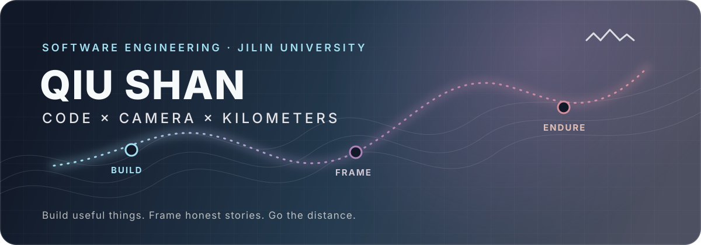
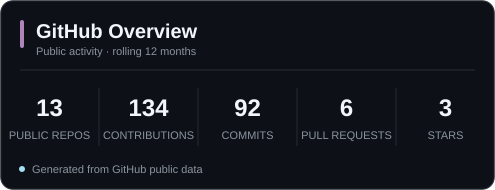
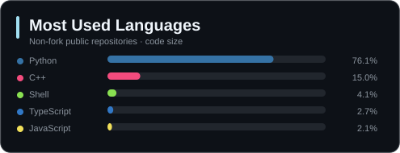

**中文** · [English](README_EN.md)

  

  
  
  
  

  
  
  

## 你好，我是丘山

吉林大学软件工程专业学生，同时长期进行摄影创作和长跑训练。

我希望自己不只是完成课程与比赛，而是能够不断积累完整项目的设计、开发和迭代经验。目前主要关注 AI 应用、计算机视觉、全栈产品与智能交互，也在尝试把软件开发能力用于解决摄影、学习和训练中的实际问题。

| <code>CODE / 工程</code> | <code>CAMERA / 影像</code> | <code>KILOMETERS / 长跑</code> |
|:---|:---|:---|
| AI 应用、计算机视觉、全栈产品、嵌入式交互 | 活动与人像摄影、后期工作流、创作者工具 | 公路跑、越野跑、训练计划与数据复盘 |

## 代表项目 · Featured Work

### 01 / [FurColor Studio](https://github.com/PWJCSqiushan/FurColor-Studio) <code>ACTIVE</code>

面向兽装活动摄影的本地优先 AI 批量后期工作站。项目来源于实际摄影交付需求，将选片、人脸隐私复核、参考样片驱动的基础调色、眼睛增强、水印、人工质检与最终交付整合为一套完整流程。

- <code>Python</code> <code>FastAPI</code> <code>OpenCV</code> <code>YuNet</code> <code>Computer Vision</code>
- 优先在本地处理真实照片，减少商业摄影工作中的隐私风险
- 通过“分析 → 复核 → 训练 → 重新分析”持续积累人工反馈并校准误检
- 正在继续完善白平衡、主体曝光、局部蒙版和多用户部署能力

[查看项目说明与完整工作流 →](https://github.com/PWJCSqiushan/FurColor-Studio#readme)

---

### 02 / [JKS](https://github.com/PWJCSqiushan/JKS) <code>IN DEVELOPMENT</code>

本地智能语音交互助手。电脑端负责录音、语音识别、智能体调用和语音合成，ESP32-S3 外接圆形 AMOLED 屏幕负责显示表情状态，形成从语音输入到硬件反馈的完整交互链路。

- <code>Python</code> <code>C++</code> <code>ESP32-S3</code> <code>STT / TTS</code> <code>AI Agent</code>
- 支持本地智能体、API 服务与命令行回退等多种调用方式
- 将软件端语音流程、串口通信与嵌入式显示统一到同一套系统中
- 持续研究更加自然、稳定的人机交互方式

[查看架构、硬件与快速开始 →](https://github.com/PWJCSqiushan/JKS#readme)

## 其他项目 · More Projects

| 项目 | 主要内容 | 技术与定位 |
|---|---|---|
| **[StockHub](https://github.com/PWJCSqiushan/stockhub)** 影像素材平台 | 完成创作者上传、EXIF 展示、用户、订单、下载和管理后台等业务链路，探索个人影像作品展示与交易方式 | <code>Next.js</code> <code>TypeScript</code> <code>Prisma</code> 全栈产品原型 |
| **[chaoxing-fanya](https://github.com/PWJCSqiushan/chaoxing-fanya)** 超星学习通自动化工具 | 在开源项目基础上继续开发，补充 Web 可视化、OCR、题库接入、通知和便携打包能力 | <code>Python</code> <code>Flask</code> <code>React</code> 开源二次开发 |

<strong>展开项目档案 / Project archive</strong>

| 项目 | 一句话说明 |
|---|---|
| [chaoxing-quiz-pdf](https://github.com/PWJCSqiushan/chaoxing-quiz-pdf) | 抓取、整理题目并生成可打印 PDF 的学习资料工具 |
| [hospital-management-system](https://github.com/PWJCSqiushan/hospital-management-system) | 使用 C/C++ 实现完整门诊业务流程的课程设计项目 |
| [media-marketplace](https://github.com/PWJCSqiushan/media-marketplace) | StockHub 之前用于验证产品流程的纯前端原型 |
| [cloudflare-edgetunnel-v2rayn-guide](https://github.com/PWJCSqiushan/cloudflare-edgetunnel-v2rayn-guide) | 根据实际部署与排障过程整理的网络配置指南 |

## 当前方向 · Current Focus

- **项目开发：**继续完善已有项目的稳定性、用户体验感与部署方案
- **AI 研究：**参与声音识别、计算机视觉的更广泛研究，积累更多智能系统的工程经验
- **专业基础：**系统学习 C++ 程序设计竞赛、算法、计算机系统与数学建模
- **影像创作：**持续练习活动、人像与视频拍摄，完善 Lightroom、Photoshop 与 DaVinci Resolve 工作流
- **长跑训练：**结合训练数据、训练周期和阶段复盘，为长跑训练提供科学、精确的指导

## 技术栈与工具 · Tech Stack

以下内容综合了已经在项目中使用的技术，以及现阶段重点学习和补强的方向。

  <strong>Languages</strong>  
  

  <strong>AI · Web · Data</strong>  
  

  <strong>Engineering · Creative</strong>  
  

## GitHub 数据 · Development Activity

  

  
  

贡献热力图展示过去一年的 GitHub 公开活动；统计卡片由仓库内脚本生成，语言占比按非 Fork 公开仓库的代码体积统计，不再依赖第三方统计卡片服务。

## 个人方向 · Beyond Development

- 📷 持续进行拍摄活动、人像与视频拍摄、后期剪辑与调色处理，并将真实的需求转化为软件功能
- 🏃 参加路跑、越野跑与高校中长跑赛事，重视训练计划和赛后复盘
- 📚 推进程序设计竞赛、数学竞赛、数学建模等的长期学习

## 联系与交流 · Connect

如果你对 **AI 与影像、创作者工具、语音交互、开源协作** 感兴趣，欢迎：

- [公开留言或提出合作想法](https://github.com/PWJCSqiushan/PWJCSqiushan/issues/new?template=say-hello.yml)
- [浏览全部仓库](https://github.com/PWJCSqiushan?tab=repositories)
- [发送邮件](mailto:dongzongyue@gmail.com)
